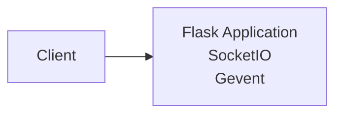
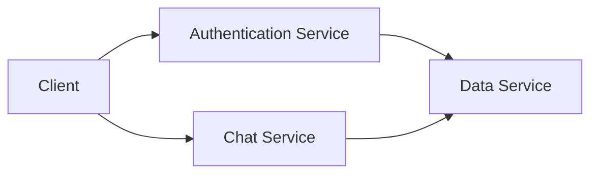

# Architecture Analysis of `voice-be`

This document analyzes the architecture of the `voice-be` repository, a Flask-based application using SocketIO for real-time communication.

## Overall System Architecture and Design Patterns

The `voice-be` application follows a client-server architecture.  The server, implemented using Flask and SocketIO, handles real-time communication between clients.  The application uses a publish-subscribe pattern via SocketIO rooms to manage communication between users within specific rooms.  There's no explicit database or persistent storage indicated in the provided code.

The application uses a simple, monolithic design. All functionality resides within the `api/server.py` file. This lacks clear separation of concerns and may hinder scalability and maintainability in the long run.

## Component Relationships and Dependencies

The system consists of the following main components:

* **Flask Application:** The core web framework, handling HTTP requests and routing.
* **SocketIO:** Enables real-time, bidirectional communication between the server and clients.
* **Gevent:** An asynchronous networking library used to improve performance and concurrency.

The dependencies are clearly defined in `requirements.txt`.  The Flask application depends on SocketIO and Gevent for its real-time functionality.  The relationship is straightforward: Flask provides the basic web server, SocketIO adds the real-time capabilities, and Gevent enhances performance.

## Service Architecture and Modularity

Currently, the application is a single, monolithic service.  All logic resides within `api/server.py`. This lacks modularity and makes it difficult to scale and maintain.  Future development should consider separating concerns into distinct services or modules.  For example, a separate module could handle user authentication, another for data processing, and another for the SocketIO communication logic.

## Data Flow and System Boundaries

The data flow is relatively simple:

1. Clients connect to the server.
2. Clients join a specific room using the `join` event.
3. Clients send data using the `data` event.
4. The server broadcasts the received data to all clients in the same room.

The system boundary is defined by the server's API.  Clients interact with the server through SocketIO events.  There are no external dependencies or integrations shown in the provided code.

## Scalability and Maintainability Considerations

The current monolithic architecture significantly limits scalability and maintainability.  Specific issues include:

* **Single Point of Failure:** The entire application runs in a single process.  A crash in one part of the application brings down the entire system.
* **Limited Scalability:**  Horizontal scaling (adding more servers) is difficult with the current design.
* **Difficult Maintenance:**  Adding new features or fixing bugs becomes increasingly complex as the codebase grows.
* **Lack of Testing:**  The absence of any testing framework makes it difficult to ensure the correctness and reliability of the application.

## Architectural Strengths and Potential Improvements

**Strengths:**

* Simple and easy to understand (for now).
* Uses well-established libraries (Flask, SocketIO, Gevent).

**Potential Improvements:**

1. **Microservices Architecture:** Refactor the application into smaller, independent microservices. This will improve scalability, maintainability, and resilience.  For example:
    * **Authentication Service:** Handles user authentication and authorization.
    * **Chat Service:** Manages real-time communication via SocketIO.
    * **Data Service:**  Handles data persistence and retrieval (if needed).

2. **Database Integration:** Implement a database (e.g., PostgreSQL, MongoDB) for persistent storage of user data, chat history, or other relevant information.

3. **Testing:** Introduce a comprehensive testing strategy, including unit, integration, and end-to-end tests.

4. **Deployment Strategy:** The `docker-compose.yml` file suggests a Docker-based deployment, which is good. However, the `vercel.json` file indicates an attempt to deploy to Vercel, which is not suitable for a long-running server application like this.  Focus on Docker and potentially Kubernetes for production deployment.

5. **Error Handling:** While `@socketio.on_error_default` exists, it's rudimentary. Implement more robust error handling and logging to facilitate debugging and monitoring.

6. **Configuration Management:**  Move hardcoded values (like `app.secret_key`) to environment variables or a configuration file.

## Architectural Diagrams

A simple diagram illustrating the current architecture:

A proposed microservices architecture:

This analysis provides a starting point for improving the architecture of the `voice-be` application.  Implementing the suggested improvements will significantly enhance its scalability, maintainability, and overall robustness.