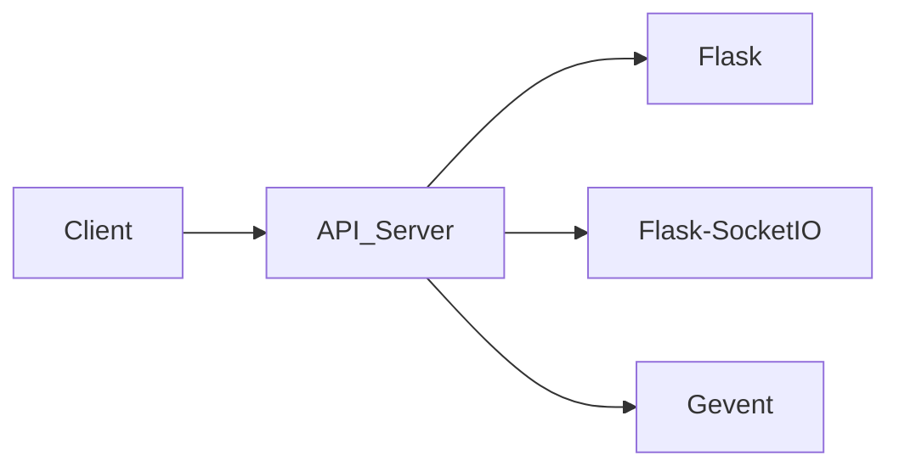

# Architecture Analysis of `voice-be`

This document analyzes the architecture of the `voice-be` repository, a Flask-based application using SocketIO for real-time communication.

## Overall System Architecture

The `voice-be` application is a simple real-time communication server built using a microservice architecture (although only one service is present).  It uses Flask as the web framework and Flask-SocketIO for handling real-time bidirectional communication between clients and the server.  The architecture is client-server, where clients connect to the server to join rooms and exchange data.

The system consists of the following main components:

* **API Server (`api/server.py`):** This is the core component, responsible for handling client connections, managing rooms, and relaying data between clients within the same room.  It uses Flask and Flask-SocketIO.
* **Client Applications (not included):**  These are not part of the repository but are implied. They would connect to the server via SocketIO to join rooms and send/receive data.

## Component Relationships and Dependencies

The relationships are straightforward:

* Client applications depend on the API server for communication.
* The API server depends on Flask, Flask-SocketIO, and Gevent (for improved performance with SocketIO).

## Service Architecture and Modularity

Currently, the application is monolithic, with all functionality residing within a single `server.py` file.  While simple, this lacks modularity and scalability.  Future expansion would require refactoring.

## Data Flow and System Boundaries

The data flow is as follows:

1. A client connects to the server and joins a room using the `join` SocketIO event.
2. The server adds the client to the specified room.
3. Clients within the same room exchange data using the `data` SocketIO event.
4. The server relays the data to all clients in the room (excluding the sender).

The system boundary is defined by the API server.  All communication happens through the SocketIO interface.

## Scalability and Maintainability Considerations

**Scalability:** The current implementation is not highly scalable.  A single server instance handles all connections and data processing.  For increased scalability, consider:

* **Load Balancing:** Distribute client connections across multiple server instances using a load balancer.
* **Message Queue:** Use a message queue (e.g., Redis, RabbitMQ) to decouple the server from real-time data processing, allowing for asynchronous handling of messages and improved performance under high load.
* **Database:**  Currently, no persistent storage is used.  For storing room information or user data, a database (e.g., PostgreSQL, MongoDB) would be necessary for larger-scale applications.

**Maintainability:** The monolithic nature of the application makes it difficult to maintain and extend.  Refactoring into smaller, more manageable modules is crucial.

**Recommendations:**

* **Refactor `server.py`:** Break down the code into smaller, more focused modules (e.g., separate modules for room management, data handling, and user authentication).
* **Implement proper error handling:**  While a default error handler exists, more robust error handling is needed to gracefully handle various exceptions and provide informative error messages.
* **Add logging:** Implement comprehensive logging to track application events, errors, and performance metrics.
* **Unit Testing:**  Write unit tests to ensure the correctness and reliability of individual modules.
* **Consider a different deployment strategy:**  `vercel.json` suggests deployment on Vercel, which might not be ideal for a long-running server application.  Docker and Docker Compose (as defined in `docker-compose.yml`) offer better control and scalability.  However, the `compose-dev.yaml` file is problematic and should be removed or fixed.

## Architectural Strengths

* **Simplicity:** The current architecture is simple and easy to understand.
* **Real-time capabilities:**  The use of SocketIO enables real-time communication between clients.

## Architectural Weaknesses

* **Lack of modularity:** The monolithic design hinders maintainability and scalability.
* **Limited scalability:** The single-server architecture is a bottleneck under high load.
* **Missing persistent storage:**  No database is used, limiting the application's capabilities.
* **Inconsistent deployment configurations:** The `docker-compose.yml` and `vercel.json` files suggest conflicting deployment strategies.

This analysis provides a starting point for improving the architecture of the `voice-be` application.  Addressing the identified weaknesses will lead to a more robust, scalable, and maintainable system.