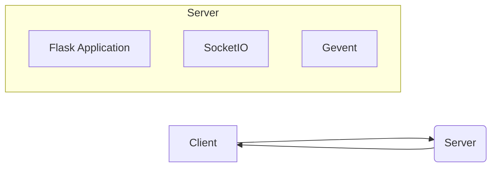

# voice-be High-Level Design Document

This document outlines the high-level design of the `voice-be` application, a server-side application for a voice application.  The analysis is based on the provided code and configuration files.

## 1. System Overview

`voice-be` is a real-time voice communication application built using Flask, Flask-SocketIO, and Gevent. It utilizes WebSockets for bidirectional communication between clients and the server.  The application allows users to join rooms and exchange voice data within those rooms.  The current implementation lacks a persistent data store (database).

## 2. Architecture

The system follows a client-server architecture.

* **Client:**  (Not defined in the provided code)  This would be a separate application (likely a mobile or web app) responsible for capturing audio, encoding it, sending it to the server, and receiving audio from other clients in the same room.
* **Server:**  The server is implemented using Flask, leveraging Flask-SocketIO for real-time communication and Gevent for asynchronous handling of multiple connections.

## 3. Component Design

### 3.1 Flask Application (`api/server.py`)

The Flask application acts as the core of the server. It handles WebSocket connections, manages rooms, and routes messages.

* **`join` event handler:**  Handles user joining a room.  It adds the user to the room using SocketIO's `join_room` function and broadcasts a 'ready' message to other users in the room.
* **`data` event handler:** Handles the transfer of voice data between clients within a room.  It receives data, logs it, and broadcasts it to all other users in the room.
* **`default_error_handler`:** A basic error handler that prints errors and stops the SocketIO server.  More robust error handling is needed for production.

### 3.2 SocketIO

Flask-SocketIO is used to manage WebSocket connections and handle real-time communication.  It provides the mechanisms for broadcasting messages to specific rooms.

### 3.3 Gevent

Gevent is used for asynchronous I/O, allowing the server to handle multiple concurrent connections efficiently.

## 4. API Documentation

The API is event-driven through SocketIO.

| Event      | Direction | Data                               | Description                                         |
|------------|-----------|------------------------------------|-----------------------------------------------------|
| `join`     | Client -> Server | `{"username": string, "room": string}` | User joins a room.                               |
| `ready`    | Server -> Client | `{"username": string}`             | Notifies clients in a room that a new user has joined.|
| `data`     | Client -> Server | `{"username": string, "room": string, "data": binary}` | Client sends voice data.                         |
| `data`     | Server -> Client | `binary`                            | Server broadcasts voice data to other clients in the room.|

## 5. Database Schema and Data Models

The current implementation lacks a database.  For a production-ready system, a database is crucial for storing user information, room details, and potentially recording voice data.  A suitable database could be PostgreSQL or MongoDB.

**Proposed Database Schema (PostgreSQL example):**

* **Users table:**
    * `id` (SERIAL PRIMARY KEY)
    * `username` (VARCHAR(255) UNIQUE NOT NULL)
    * ... other user details ...

* **Rooms table:**
    * `id` (SERIAL PRIMARY KEY)
    * `room_name` (VARCHAR(255) UNIQUE NOT NULL)
    * ... other room details ...

* **RoomUsers table (many-to-many relationship):**
    * `room_id` (INTEGER REFERENCES Rooms(id))
    * `user_id` (INTEGER REFERENCES Users(id))

## 6. System Integration Patterns

Currently, there are no explicit integration patterns.  Future integration could include:

* **Authentication:** Integrate with an authentication service (e.g., OAuth 2.0) to secure user accounts.
* **Message Queues:** Use a message queue (e.g., RabbitMQ, Kafka) to handle asynchronous tasks like recording voice data or sending notifications.
* **Cloud Storage:** Integrate with cloud storage (e.g., AWS S3, Google Cloud Storage) to store recorded voice data.

## 7. Deployment

The `docker-compose.yml` file suggests a Docker-based deployment.  The `vercel.json` file indicates an attempt at deploying to Vercel, which is not ideal for a real-time application like this.  A more suitable deployment platform would be a cloud-based solution optimized for real-time applications (e.g., AWS Elastic Beanstalk, Google Cloud Run, Heroku).

## 8. Recommendations

* **Implement a persistent data store:**  Add a database to store user and room information.
* **Improve error handling:** Implement more robust error handling to gracefully handle exceptions and provide informative error messages.
* **Add authentication:** Integrate with an authentication service to secure user accounts.
* **Implement robust logging:** Add detailed logging to aid in debugging and monitoring.
* **Refactor `default_error_handler`:** Instead of stopping the server on error, log the error and potentially attempt to recover.
* **Consider using a more suitable deployment platform:**  Choose a platform optimized for real-time applications.
* **Add unit and integration tests:**  Write tests to ensure the application's functionality and stability.
* **Optimize for scalability:**  Consider using load balancing and other techniques to handle a large number of concurrent users.

This HLD provides a foundation for further development.  More detailed design specifications will be needed as the project progresses.