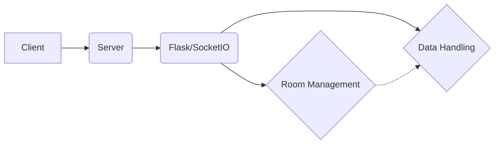

# voice-be High-Level Design Document

This document outlines the high-level design of the `voice-be` application, a backend server for a voice application.  The analysis is based on the provided code and configuration files.

## 1. System Overview

`voice-be` is a real-time voice communication application server built using Flask, Flask-SocketIO, and Gevent. It facilitates communication between users within designated rooms.  The system uses WebSockets for real-time data transfer.  The current implementation lacks a persistent data store (database).

## 2. Architecture

The system follows a client-server architecture.

* **Client:**  A voice application (not included in this repository) connects to the server via WebSockets.
* **Server:** A Flask application handles WebSocket connections and manages rooms and data transfer.
* **Flask/SocketIO:** The core framework for handling HTTP requests and WebSocket connections.
* **Room Management:**  Manages user joining and leaving rooms.
* **Data Handling:**  Receives and broadcasts voice data between clients within the same room.

## 3. Component Design

### 3.1 Server (api/server.py)

The server uses Flask and Flask-SocketIO to handle WebSocket connections.  Key components include:

* **SocketIO Initialization:**  Initializes SocketIO with the Flask application.  `cors_allowed_origins="*"` allows connections from any origin, which is a security risk and should be restricted in production.
* **`join` Event Handler:** Handles user joining a room.  It adds the user to the room using `join_room()` and broadcasts a 'ready' event to the room.
* **`data` Event Handler:** Handles the transfer of voice data. It receives data, logs it, and broadcasts it to the room using `emit()`.  `skip_sid=request.sid` prevents the sender from receiving their own data.
* **Error Handling:** A default error handler logs errors and stops the SocketIO server.  More robust error handling is needed for production.

### 3.2 Deployment

The project includes `docker-compose.yml` for local development and a `vercel.json` file suggesting deployment to Vercel.  The `compose-dev.yaml` file is incomplete and seems intended for a different purpose (possibly Docker-in-Docker).

## 4. API Documentation

The API uses WebSocket events:

| Event Name | Direction | Data Payload | Description |
|---|---|---|---|
| `join` | Client -> Server | `{username: string, room: string}` | User joins a room |
| `ready` | Server -> Client | `{username: string}` | Notifies clients in the room that a user has joined |
| `data` | Client <-> Server | `{data: binary/string}` | Transmits voice data |

## 5. Database Schema and Data Models

The current implementation lacks a database.  For a production-ready system, a database is crucial for storing user information, room details, and potentially recording voice data.  A suitable database could be PostgreSQL, MySQL, or MongoDB.  The schema would need to include:

* **Users:** `id`, `username`, etc.
* **Rooms:** `id`, `name`, etc.
* **Room Members:** `room_id`, `user_id`, etc. (Many-to-many relationship between Users and Rooms)

## 6. System Integration Patterns

Currently, there are no external system integrations.  Future integrations could include:

* **Authentication:** Integrate with an authentication service (e.g., OAuth 2.0) for secure user authentication.
* **Storage:** Integrate with cloud storage (e.g., AWS S3, Google Cloud Storage) for storing voice recordings.
* **Transcription:** Integrate with a speech-to-text service (e.g., Google Cloud Speech-to-Text, Amazon Transcribe) for transcribing voice data.

## 7. Recommendations

* **Security:**  Replace `cors_allowed_origins="*"` with a more restrictive configuration to prevent unauthorized access. Implement proper authentication and authorization.
* **Error Handling:** Improve error handling to gracefully handle exceptions and provide informative error messages.
* **Scalability:** Consider using a message queue (e.g., Redis, RabbitMQ) to handle a large number of concurrent users.
* **Database:** Implement a persistent database to store user and room information.
* **Testing:** Add unit and integration tests to ensure the application's reliability.
* **Deployment:** Refine the deployment strategy and choose a suitable platform (e.g., Docker Swarm, Kubernetes) for production deployment.  The `compose-dev.yaml` file needs review or removal.

This HLD provides a foundation for further development.  Detailed design specifications for each component and the database schema should be created before implementation.